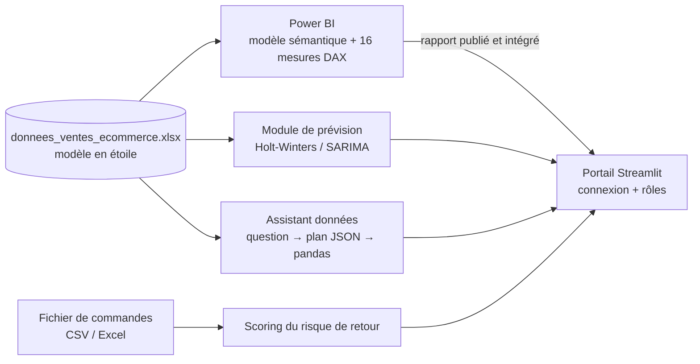
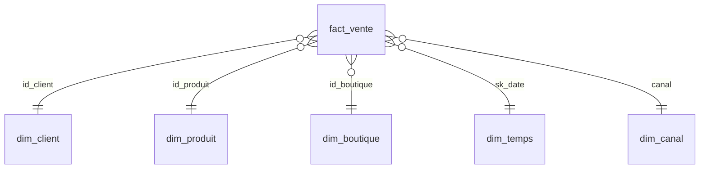

# ShopPulse — Plateforme Data & BI des ventes e-commerce

ShopPulse est une plateforme d'analyse des ventes pour une enseigne e-commerce tunisienne multicanal (magasins, site web, application mobile, marketplace et réseaux sociaux). Elle réunit, dans un même projet, toute la chaîne de valeur de la donnée :

1. **Un entrepôt de données en étoile** (tables de faits et de dimensions) contenant cinq années de ventes.
2. **Un tableau de bord Power BI** de trois pages, construit sur 16 mesures DAX, pour piloter l'activité, la rentabilité et les retours.
3. **Un module de prévision** du chiffre d'affaires sur 12 mois (Holt-Winters et SARIMA), validé par backtesting.
4. **Un scoring du risque de retour** qui note chaque commande de 0 à 100 et explique les facteurs de risque détectés.
5. **Un assistant données** qui répond en langage naturel à des questions sur les ventes, les calculs étant exécutés par pandas sur les vraies données.
6. **Un portail web Streamlit** sécurisé (connexion, inscription vérifiée par e-mail, rôles) qui rassemble tous ces modules.

> Les données sont **synthétiques** : elles ont été générées pour reproduire un contexte réaliste (villes et régions tunisiennes, montants en TND, saisonnalité Ramadan / soldes / Black Friday), sans aucune donnée réelle de client.

---

## Sommaire

- [Problématique et objectifs](#problématique-et-objectifs)
- [Architecture](#architecture)
- [Les données](#les-données)
- [Le tableau de bord Power BI](#le-tableau-de-bord-power-bi)
- [La prévision des ventes](#la-prévision-des-ventes)
- [Le scoring du risque de retour](#le-scoring-du-risque-de-retour)
- [L'assistant données](#lassistant-données)
- [Le portail Streamlit](#le-portail-streamlit)
- [Installation et lancement](#installation-et-lancement)
- [Structure du dépôt](#structure-du-dépôt)
- [Technologies](#technologies)
- [Limites et pistes d'amélioration](#limites-et-pistes-damélioration)

---

## Problématique et objectifs

Une enseigne qui vend sur plusieurs canaux accumule beaucoup de données de commandes, mais les décideurs manquent souvent d'une vue claire et partagée pour répondre à des questions simples :

- Où en est-on par rapport aux objectifs de chaque boutique ?
- Quels segments de clients, quelles catégories et quelles régions sont réellement rentables ?
- Quels canaux génèrent le plus de retours, et combien d'argent est exposé ?
- Quel chiffre d'affaires peut-on attendre l'année prochaine ?
- Comment obtenir un chiffre précis sans savoir écrire une requête ?

ShopPulse répond à ces questions avec trois niveaux d'analyse :

| Niveau | Question | Module |
|---|---|---|
| **Descriptif** | Que s'est-il passé ? | Tableau de bord Power BI, assistant données |
| **Prédictif** | Que va-t-il se passer ? | Prévision Holt-Winters / SARIMA |
| **Préventif** | Quelles commandes surveiller ? | Scoring du risque de retour |

---

## Architecture



Le classeur Excel joue le rôle d'entrepôt de données : il est lu directement par Power BI (via Power Query) et par l'application Python. Un seul fichier alimente donc l'ensemble des modules, ce qui garantit que tous les chiffres affichés sont cohérents entre eux.

---

## Les données

Le fichier `donnees_ventes_ecommerce.xlsx` contient un **schéma en étoile** couvrant la période du **1er janvier 2021 au 31 décembre 2025**.

| Table | Lignes | Contenu |
|---|---:|---|
| `fact_vente` | 30 000 | Une ligne par commande : date, heure, client, boutique, produit, canal, quantité, montant, remise, coût, frais et mode de livraison, moyen de paiement, statut, délai, motif d'annulation, note client, score de risque de retour, indicateur de retour |
| `dim_client` | 1 500 | Profil client : âge et tranche d'âge, ville, région, canal d'acquisition, date d'inscription, dernière commande, ancienneté, segment, valeur et score de fidélité |
| `dim_produit` | 36 | Catalogue : catégorie, sous-catégorie, marque, prix et coût unitaires, statut, date de lancement |
| `dim_boutique` | 20 | Points de vente : ville, région, type, effectif, date d'ouverture, statut, objectif mensuel de CA |
| `dim_temps` | 1 826 | Calendrier : jour, mois, trimestre, année, semaine, jour de la semaine, week-end, début/fin de mois |
| `dim_canal` | 5 | Canaux de vente, famille de canal et coût d'acquisition moyen |

**Quelques repères sur le jeu de données :**

- **Canaux** : Magasin, Site web, App mobile, Marketplace, Réseaux sociaux.
- **Catégories** : Électronique, Mode, Maison & Déco, Beauté & Santé, Sport & Loisirs, Alimentation.
- **Régions** : Grand Tunis, Nord, Centre, Sud.
- **Moyens de paiement** : carte bancaire, wallet mobile, paiement à la livraison, espèces, virement.
- **Statuts de commande** : Livrée (≈ 91 %), Retournée (≈ 5 %), Annulée (≈ 3 %), Expédiée, En préparation.

### Modèle de données



La table de faits est reliée à chaque dimension par une relation plusieurs-à-un, ce qui permet de filtrer n'importe quel indicateur par client, produit, boutique, date ou canal.

---

## Le tableau de bord Power BI

Le rapport est enregistré au format **projet Power BI (`.pbip`)**, un format texte (TMDL + JSON) qui se versionne proprement avec Git : chaque mesure, table, relation et visuel apparaît en clair dans le dépôt.

### Les mesures

Les 16 mesures DAX sont regroupées dans une table masquée `_Mesures`, rangée en trois dossiers.

| Dossier | Mesures |
|---|---|
| **01 Activité** | Nb Clients, Nb Commandes, Nb Commandes Livrées, CA Total (net des annulations et retours), % Objectif Boutique |
| **02 Rentabilité** | CA Moyen Client, Marge Brute, Taux Marge, Panier Moyen, Taux Remise Moyen |
| **03 Retours & Qualité** | Taux Retour, CA Exposé Retours (score ≥ 70), Nb Commandes Annulées, Score Risque Retour Moyen, Note Client Moyenne, Clients Inactifs 90 j |

Deux colonnes calculées complètent le modèle : `Heure_Entiere` (analyse par heure de la journée) et `Statut_Risque_Retour` (Faible < 40 ≤ Moyen < 70 ≤ Élevé).

### Les trois pages

| Page | Ce qu'elle montre |
|---|---|
| **1. Vue d'ensemble & Activité commerciale** | Cartes KPI (clients, commandes, CA net, atteinte de l'objectif), évolution mensuelle du CA, répartition par segment, par mode de livraison, par canal et par région, classement des boutiques |
| **2. Rentabilité & Segmentation client** | CA moyen par client, marge brute, panier moyen, taux de remise ; rentabilité par segment, marge par catégorie et par région, comparatif des boutiques, clients à plus forte valeur |
| **3. Retours, Qualité & Prévention** | Taux de retour, CA exposé, commandes annulées, clients inactifs ; répartition par niveau de risque, commandes par heure, taux de retour par canal et dans le temps, annulations par région, table des commandes à surveiller |

Le détail de chaque mesure et de chaque visuel se trouve dans [`Dashboard_PowerBI_Mesures_Visuels_Pages.pdf`](Dashboard_PowerBI_Mesures_Visuels_Pages.pdf) et [`Documentation_Dashboard_PowerBI.pdf`](Documentation_Dashboard_PowerBI.pdf).

---

## La prévision des ventes

Le module de prévision estime les **12 prochains mois** du chiffre d'affaires net. L'étude de prévision (dont les résultats sont dans `outputs/`) porte aussi sur le nombre de commandes valides ; le portail, lui, affiche la prévision du CA avec ses graphiques et son backtesting.

**Méthode :**

1. Les ventes sont agrégées par mois (60 mois d'historique).
2. Les modèles travaillent sur le **logarithme** de la série, car la croissance est multiplicative (en pourcentage) et non linéaire.
3. Deux modèles sont comparés :
   - **Holt-Winters** : tendance additive amortie (φ = 0,85) et saisonnalité additive sur 12 mois ;
   - **SARIMA(1,1,0)(0,1,1)[12]**.
4. **Backtesting** : chaque modèle est entraîné sur les 48 premiers mois puis testé sur les 12 derniers mois déjà connus. Les erreurs (MAE, RMSE, MAPE) servent à choisir le modèle le plus fiable.
5. Le modèle retenu est réentraîné sur tout l'historique pour produire la prévision, avec un **intervalle de confiance à 80 %**.

**Résultats obtenus** (voir `outputs/rapport_synthese_ventes.txt`) :

| Indicateur | Modèle retenu | MAPE (backtest) | Réel 2025 | Prévu 2026 |
|---|---|---:|---:|---:|
| Chiffre d'affaires net (TND) | SARIMA | 10,8 % | 4 019 376 | 6 826 468 |
| Nombre de commandes valides | SARIMA | 6,8 % | 10 922 | 16 808 |

Les prévisions mensuelles détaillées sont exportées dans `outputs/` (CSV) et `previsions_ventes.xlsx`, et les graphiques dans les fichiers `forecast_*.png`.

> La hausse prévue (+70 % sur le CA) reflète la forte tendance de croissance présente dans les données synthétiques ; l'intervalle de confiance s'élargit nettement en fin d'horizon et doit être lu avec prudence.

---

## Le scoring du risque de retour

Cette page du portail analyse un fichier de commandes (CSV ou Excel, par exemple `app/exemple_commandes_test.csv`) et attribue à chaque ligne un **score de 0 à 100** accompagné d'une explication en clair.

Le score part d'une base de 20 points, à laquelle s'ajoutent des points pour chaque facteur de risque :

| Facteur détecté | Points |
|---|---:|
| Catégorie Mode (taille ou modèle inadapté) | + 22 |
| Paiement à la livraison | + 14 |
| Catégorie Électronique | + 10 |
| Canal Réseaux sociaux | + 10 |
| Remise ≥ 30 % du prix catalogue | + 8 |
| Délai de livraison ≥ 5 jours | + 7 |
| Montant supérieur à 1 500 TND | + 6 |

| Score | Statut |
|---|---|
| 0 – 39 | 🟢 Faible |
| 40 – 69 | 🟡 Moyen |
| 70 – 100 | 🔴 Élevé, à surveiller |

Ces seuils sont **identiques** à ceux du tableau de bord Power BI (colonne `Statut_Risque_Retour` et mesure « CA Exposé Retours »), ce qui garantit que le portail et le rapport parlent le même langage. Le résultat peut être téléchargé pour être traité par les équipes.

---

## L'assistant données

L'assistant permet de poser des questions en français, par exemple *« Quel est le CA de la région Sud en 2024 ? »* ou *« Quels sont les 5 produits les plus vendus sur l'application mobile ? »*.

Pour éviter toute réponse inventée, le traitement se fait en trois étapes :

```
Question libre
   → l'API Gemini traduit la question en un plan structuré (JSON : table, filtres, regroupement, opération)
   → pandas exécute ce plan sur le fichier Excel (calcul réel et reproductible)
   → l'API Gemini reformule le résultat calculé en une phrase claire
```

Le modèle de langage ne calcule donc jamais les chiffres lui-même : il ne fait que comprendre la question et rédiger la réponse. Si l'information demandée n'existe pas dans les données, l'assistant le signale au lieu de deviner. Des modèles de secours sont essayés automatiquement si le modèle principal est indisponible.

L'assistant est disponible sur une page dédiée du portail et sous forme de **bulle de discussion flottante** sur toutes les pages. Une version en ligne de commande (`chatbot.py`) est également fournie.

---

## Le portail Streamlit

Le dossier `app/` contient le portail web qui rassemble tous les modules.

**Authentification :**

- connexion avec verrouillage temporaire après 5 tentatives échouées ;
- création de compte en deux étapes, avec **code de vérification envoyé par e-mail** (valable 10 minutes) ;
- sans configuration SMTP, un mode démo affiche le code à l'écran.

**Rôles et accès :**

| Rôle | Accueil | Power BI | Prévision | Risque de retour | Assistant | Administration |
|---|:-:|:-:|:-:|:-:|:-:|:-:|
| **Admin** | ✅ | ✅ | ✅ | ✅ | ✅ | ✅ |
| **Agent** | ✅ | ✅ | ✅ | ✅ | ✅ | ❌ |
| **Utilisateur** | ✅ | ❌ | ❌ | ❌ | ✅ | ❌ |

Les nouveaux comptes reçoivent le rôle *Utilisateur* ; un administrateur peut ensuite modifier leur rôle ou les supprimer depuis la page **Administration**. Les pages non autorisées n'apparaissent pas dans le menu.

**Comptes de démonstration** (créés au premier lancement) :

| Identifiant | Mot de passe | Rôle |
|---|---|---|
| `admin` | `admin123` | Admin |
| `agent` | `agent2025` | Agent |

---

## Installation et lancement

### Prérequis

- Python 3.10 ou plus récent
- Power BI Desktop (pour ouvrir le rapport)
- Une clé API Gemini, créée gratuitement sur [Google AI Studio](https://aistudio.google.com/apikey) (uniquement pour l'assistant données)

### 1. Cloner le dépôt

```bash
git clone https://github.com/ziedsoukni/ShopPulse-Plateforme-Data-BI-Ventes.git
cd ShopPulse-Plateforme-Data-BI-Ventes
```

### 2. Installer les dépendances

```bash
python -m venv .venv
# Windows
.venv\Scripts\activate
# Linux / macOS
source .venv/bin/activate

pip install -r app/requirements.txt
```

### 3. Configurer les secrets

```bash
cp app/.streamlit/secrets.toml.example app/.streamlit/secrets.toml
```

Puis renseignez dans `app/.streamlit/secrets.toml` :

- `GEMINI_API_KEY` pour l'assistant données ;
- la section `[smtp]` pour l'envoi réel des codes de vérification (facultatif).

Ce fichier est ignoré par Git et ne doit jamais être publié.

### 4. Lancer le portail

```bash
cd app
streamlit run app.py
```

L'application s'ouvre sur http://localhost:8501.

Le fichier de données est trouvé automatiquement à la racine du dépôt. Pour en utiliser un autre, définissez `EXCEL_DATA_PATH` dans `secrets.toml` ou comme variable d'environnement.

### 5. Ouvrir le rapport Power BI

1. Ouvrez `powerbiecom.pbip` dans Power BI Desktop.
2. Si le dépôt a été cloné ailleurs que dans le dossier d'origine, mettez à jour le paramètre **FichierDonnees** (*Transformer les données → Gérer les paramètres*) avec le chemin complet de `donnees_ventes_ecommerce.xlsx`, puis actualisez.
3. Pour l'afficher dans le portail, publiez le rapport dans le service Power BI, récupérez l'URL d'intégration (*Fichier → Incorporer le rapport*) et collez-la dans `POWERBI_URL` (`app/views/powerbi.py`).

### Assistant en ligne de commande (facultatif)

```bash
cp .env.example .env      # puis renseignez GEMINI_API_KEY
python chatbot.py
```

---

## Structure du dépôt

```
ShopPulse-Plateforme-Data-BI-Ventes/
├── donnees_ventes_ecommerce.xlsx        # Entrepôt de données (schéma en étoile, 2021-2025)
├── powerbiecom.pbip                     # Point d'entrée du projet Power BI
├── powerb.Report/                       # Pages, visuels et thème du rapport
├── powerb.SemanticModel/                # Tables, relations et mesures DAX (TMDL)
├── Dashboard_PowerBI_Mesures_Visuels_Pages.pdf   # Guide de lecture du tableau de bord
├── Documentation_Dashboard_PowerBI.pdf           # Documentation du rapport
├── Guide_Application_Spec_PowerBI.docx           # Spécifications du rapport
├── chatbot.py                           # Assistant données en ligne de commande
├── previsions_ventes.xlsx               # Prévisions 2026 exportées
├── forecast_*.png                       # Graphiques de prévision et de backtesting
├── outputs/                             # Prévisions mensuelles (CSV) et rapport de synthèse
└── app/                                 # Portail Streamlit
    ├── app.py                           # Connexion, inscription et navigation selon le rôle
    ├── requirements.txt
    ├── exemple_commandes_test.csv       # Fichier d'exemple pour le scoring
    ├── .streamlit/                      # Thème et modèle de configuration des secrets
    ├── assets/                          # Logo et favicon
    ├── views/                           # Accueil, Power BI, Prévision, Risque de retour, Assistant, Administration
    └── utils/
        ├── auth.py                      # Comptes, connexion, vérification par e-mail
        ├── permissions.py               # Pages autorisées par rôle
        ├── mailer.py                    # Envoi SMTP
        ├── data_config.py               # Emplacement du fichier de données
        ├── forecasting.py               # Modèles Holt-Winters et SARIMA
        ├── gemini_chat.py               # Moteur de l'assistant (plan JSON + pandas)
        ├── floating_chat.py             # Bulle de discussion flottante
        └── ui.py                        # Thème et composants visuels
```

---

## Technologies

| Domaine | Outils |
|---|---|
| Modélisation et restitution | Power BI Desktop, DAX, Power Query, format PBIP / TMDL |
| Traitement des données | Python, pandas, NumPy, openpyxl |
| Prévision | statsmodels (Holt-Winters, SARIMAX), matplotlib |
| Application web | Streamlit, streamlit-float |
| Langage naturel | API Google Gemini |
| Envoi d'e-mails | SMTP (smtplib) |

---

## Limites et pistes d'amélioration

- **Authentification de démonstration** : les comptes sont stockés dans un fichier JSON avec un hachage SHA-256. En production, il faudrait une base de données, un hachage dédié aux mots de passe (bcrypt ou argon2) et idéalement un SSO.
- **Scoring par règles** : le score de risque de retour repose sur un barème métier transparent. Une prochaine étape serait d'entraîner un modèle de classification (régression logistique, gradient boosting) sur l'historique des retours et de comparer ses performances au barème.
- **Source de données** : le classeur Excel pourrait être remplacé par une base PostgreSQL alimentée par un pipeline ETL, avec actualisation planifiée du rapport Power BI.
- **Prévision** : ajouter des variables explicatives (promotions, calendrier du Ramadan, jours fériés) et tester d'autres modèles (Prophet, modèles de gradient boosting).
